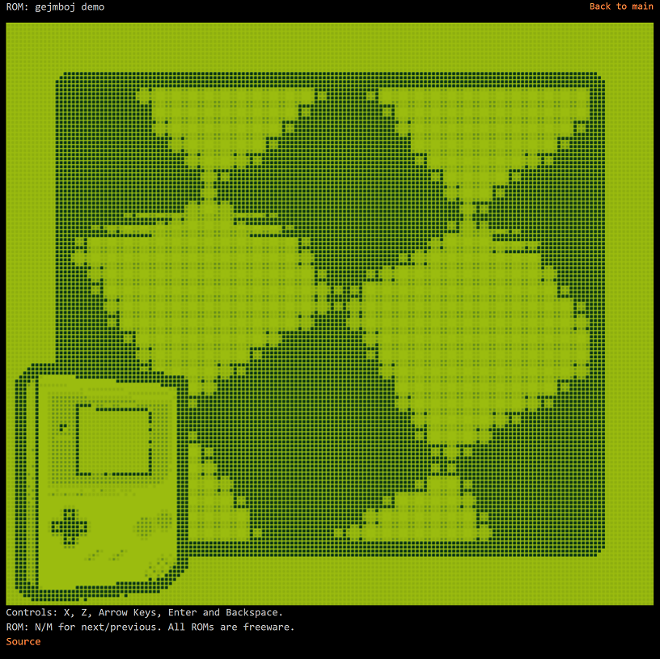

### gb-ts

-----

A Gameboy emulator written in modern TypeScript using WebGL for rendering.

#### Features
* Cycle-accurate emulation.
* Accurate LCD timing emulation.
* MBC1, MBC3.
* Joypad.
* Speed-up (press space bar).
* Passes blargg's test ROMs for cpu instructions and instruction timing.

#### Build information
1. Download source.
2. `npm install`
3. `npm run tests` to run blargg's test ROMs.
4. `npm run build` to compile.

#### Not implemented
* Cycle-accurate memory access.
* MBC2, MBC4, MBC5.
* Audio.
* Save states.

#### Helpful resources for Gameboy emulation
* https://izik1.github.io/gbops/
* http://gbdev.gg8.se/files/roms/blargg-gb-tests/
* https://blog.tigris.fr/2019/09/15/writing-an-emulator-the-first-pixel/